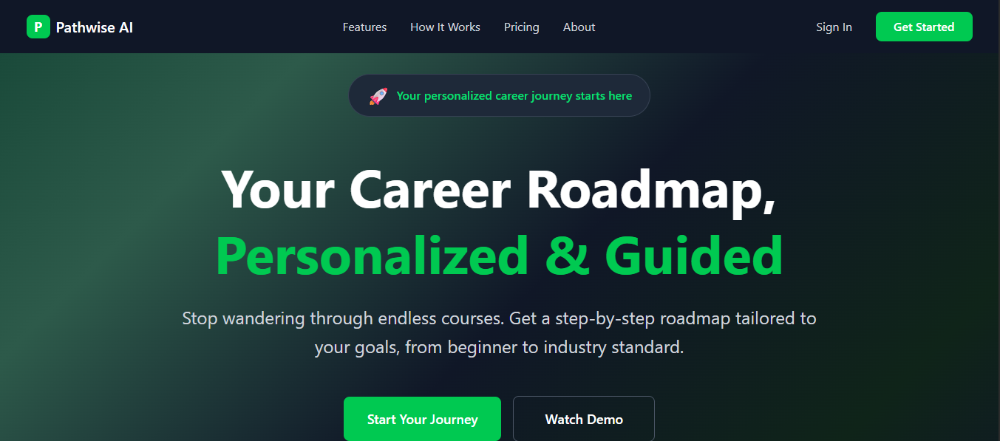

# PathWise-AI



PathWise-AI is an interactive career guidance platform designed to help Nigerian graduates and job seekers explore career paths, build relevant skills, and complete hands-on projects. The platform provides curated learning roadmaps, assessments, and project workspaces for various tech and professional roles.

## 🚀 Features

- **Career Roadmaps:** Step-by-step skill trees for roles like Frontend Developer, Backend Developer, Fullstack Developer, Product Designer, and more
- **Skill Assessments:** Interactive quizzes to validate your knowledge and earn certificates
- **Project Workspaces:** Guided, real-world projects with code editors and progress tracking
- **Resource Library:** Curated links to top learning materials for each skill
- **AI Agent Integration:** Powered by AIQ toolkit for intelligent career guidance and recommendations
- **Responsive UI:** Built with React, Tailwind CSS, and Vite for fast, modern web experience

## 📁 Project Structure

```
PathWise-AI/
├── Pathwise-frontend/
│   ├── public/
│   │   ├── images/
│   │   └── ...icons and manifest
│   ├── src/
│   │   ├── assets/
│   │   ├── components/
│   │   ├── data/
│   │   ├── pages/
│   │   ├── App.jsx
│   │   ├── main.jsx
│   │   └── ...
│   ├── index.html
│   ├── package.json
│   ├── tailwind.config.js
│   └── vite.config.js
├── Pathwise-backend/
├── nigeria_pathwise/
├── cors_proxy.py
└── README.md
```

## 🎯 Prerequisites

- Windows 10/11 with WSL2 support
- Internet connection for downloading packages
- Basic familiarity with terminal/command line
