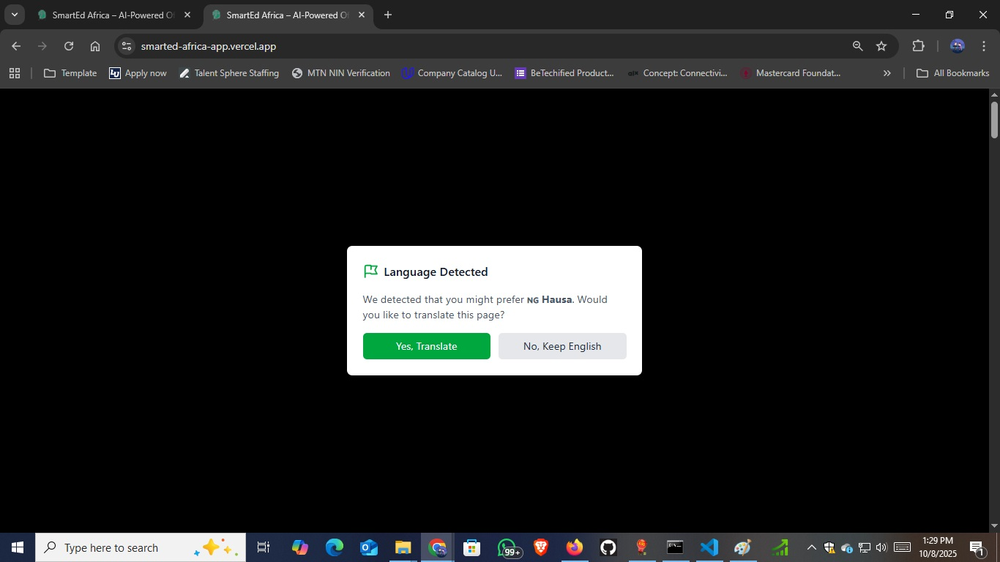
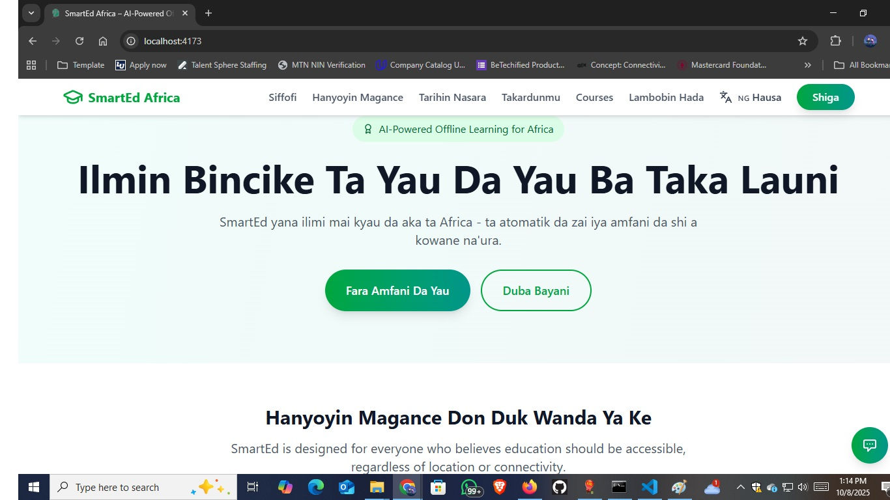
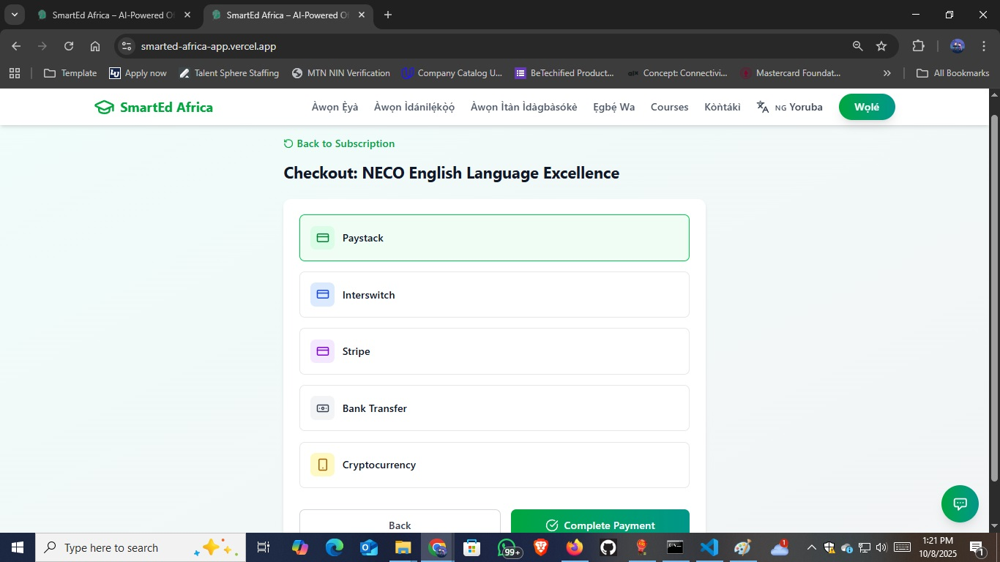

# 🧭 Project Documentation — Team 14: SmartEd Africa

## 📘 Overview

**SmartEd Africa** is Nigeria’s first AI-powered offline learning and school SaaS platform, designed to transform education across Africa through inclusive, adaptive, and accessible digital learning solutions.  
It bridges the educational gap between urban and rural communities by integrating **AI tutoring**, **offline access**, and **localized Nigerian curricula** into one unified platform.

---

## 🎯 Project Vision

To democratize education in Africa by leveraging artificial intelligence, multilingual learning, and teacher-centered analytics—empowering every learner and educator to thrive in the digital age.

---

## 💡 Problem Statement

Millions of African learners face:

- Limited internet access and digital infrastructure.
- Inconsistent learning resources aligned with local curricula.
- Lack of adaptive and personalized tutoring tools.
- Limited teacher empowerment in tracking and assessing student performance.

---

## 🚀 Our Solution

SmartEd Africa provides:

- **AI Tutoring and Adaptive Learning:** Personalized study paths tailored to each learner’s performance and pace.  
- **Offline Access:** Works seamlessly in low-connectivity rural areas via smart caching and offline modes.  
- **Teacher Empowerment Tools:** Dashboards for grading, analytics, and automated lesson plan generation.  
- **Localized Curriculum Integration:** WAEC, NECO, and state syllabi support.  
- **Multilingual Access:** Supports English, Hausa, Yoruba, and Igbo for inclusivity.  

---

## 💻 Tech Stack

| Layer | Technologies |
|--------|---------------|
| **Frontend** | React + TypeScript + Vite |
| **Backend** | Node.js + Express.js |
| **Database** | MongoDB (Mongoose ORM) |
| **AI Engine** | NLP-powered adaptive learning & recommendation system |
| **Offline Sync** | Smart caching & low-data mode for rural accessibility |
| **Cloud Infrastructure** | Secure and scalable cloud hosting for Nigerian schools |
| **Deployment** | Vercel (Frontend) & Render (Backend) |
| **Version Control** | Git + GitHub |

---

## 🌍 Impact Alignment (SDGs & Nigeria Vision 2030)

| **SDG/Policy** | **Alignment** |
|-----------------|----------------|
| **SDG 4 – Quality Education** | Delivers inclusive, affordable learning for all Nigerians. |
| **SDG 9 – Innovation & Infrastructure** | Strengthens Nigeria’s digital education infrastructure. |
| **SDG 10 – Reduced Inequalities** | Empowers rural and underserved learners. |
| **Nigeria’s Digital Economy Policy** | Supports nationwide digital literacy and EdTech adoption. |

---

## 🧠 System Architecture

```
Frontend (React + Vite)
        ↓
REST API (Node.js + Express)
        ↓
Database (MongoDB)
        ↓
AI Engine (NLP + Adaptive Learning)
        ↓
Cloud Infrastructure (Vercel/Render)
```

---

## 📷 Screenshots (Placeholders)

Include 10–15 relevant screenshots inside the `/screenshots` folder and link them here:

```markdown


<!-- 
 -->




<!--  -->


```

---

## 👥 Team Members

| **Name** | **Role** |
|-----------|-----------|
| **Ojobor Jude Ikechukwu** | Team Leader & Product Manager – Full-Stack Developer |
| **Akpom David** | Frontend Developer |
| **Omolaja Mamun** | Backend Developer |
| **Chinemeze Njoku** | AI/ML Developer |

📞 Contact: **+234 806 159 9859**  
📧 Email: **ojoborjudeik@gmail.com**

---

## 🏁 Future Enhancements

- Integration of parental monitoring dashboards  
- Full offline-first PWA architecture  
- Real-time AI chat tutor for STEM courses  
- Mobile app (Android/iOS) support  

---

## 📜 License

This project is licensed under the **MIT License**. See the `LICENSE` file for details.
