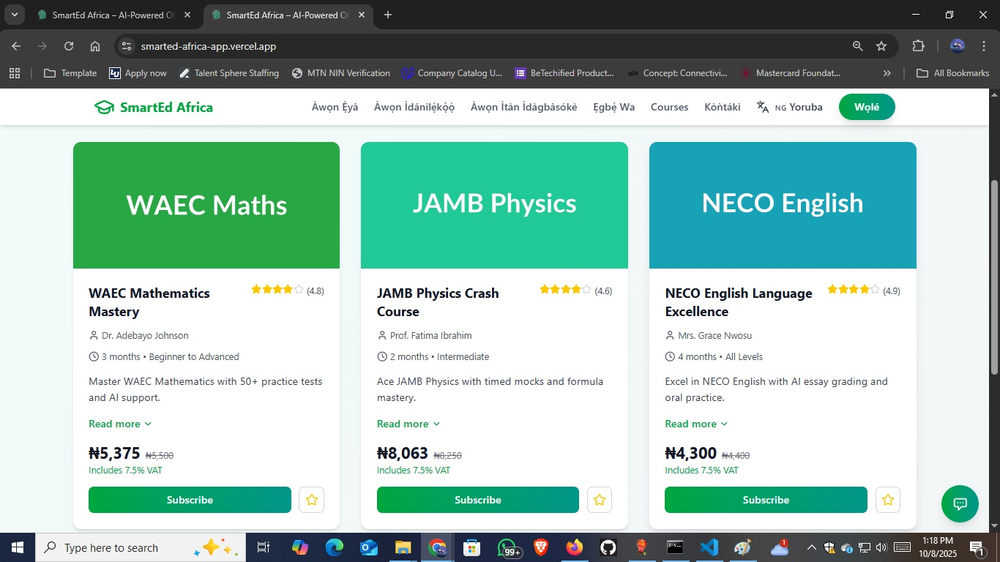
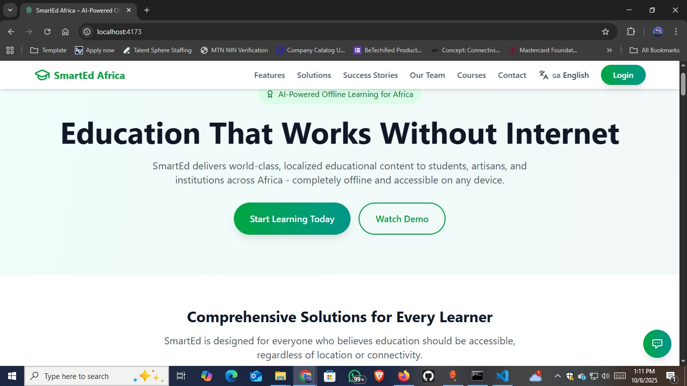
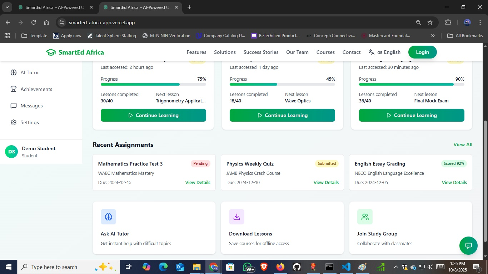
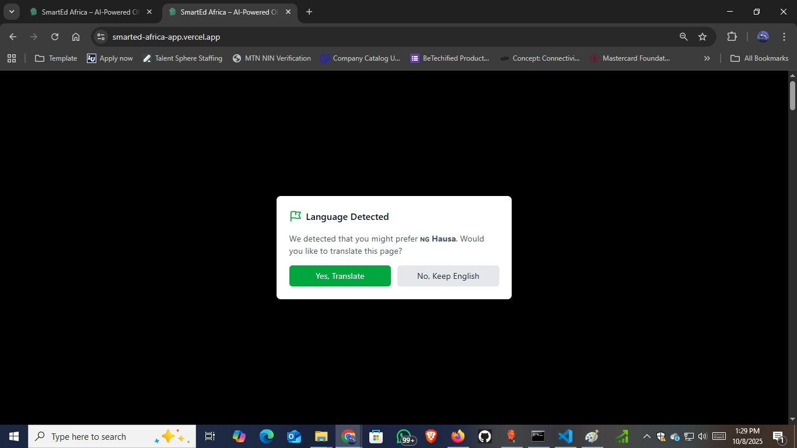
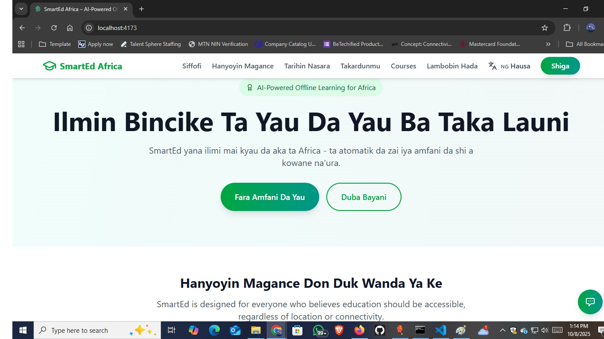
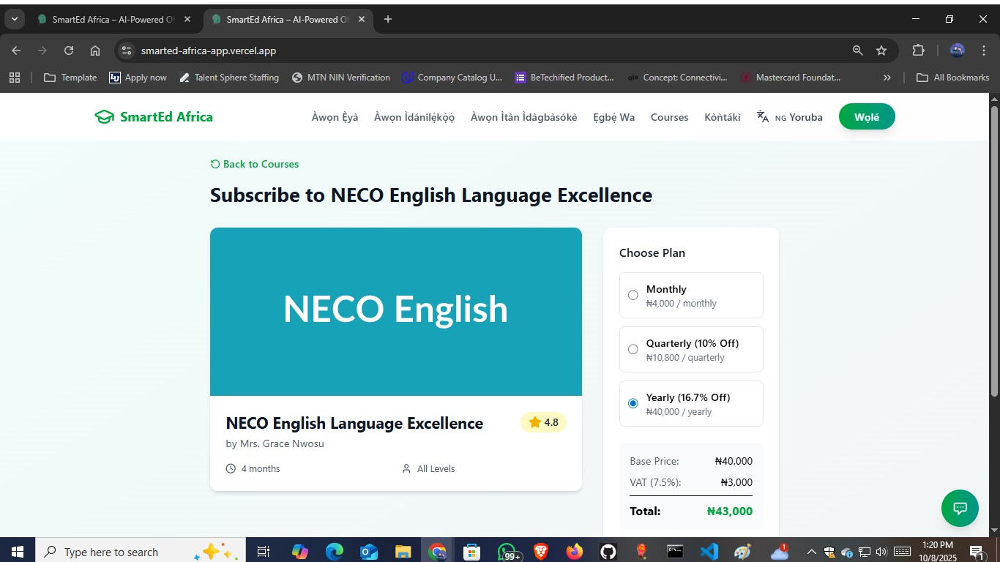
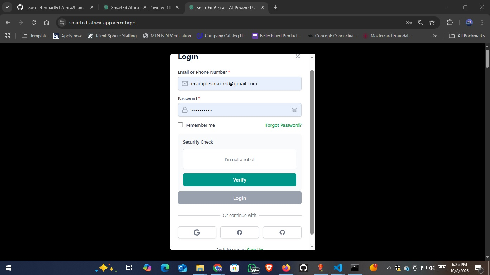
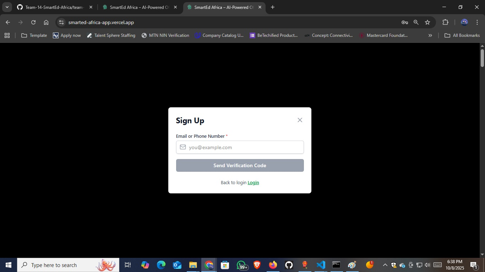
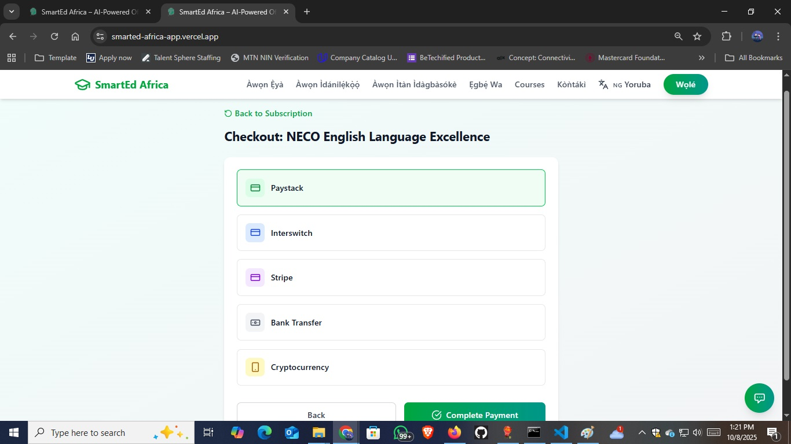

# 🌍 SmartEd Africa — Team 14 (Hackathon Nigeria)

> **Nigeria’s First AI-Powered Offline Learning & School SaaS Platform**  
> Empowering inclusive, localized, and adaptive learning experiences across Africa.

🔗 **Live Demo:** [https://smarted-africa-app.vercel.app/](https://smarted-africa-app.vercel.app/)  
💬 **Contact:** ojoborjudeik@gmail.com | 📞 +234 806 159 9859  

---

## ✨ Overview

SmartEd Africa bridges the learning gap between urban and rural communities by providing **AI-driven, multilingual, and offline-enabled digital education** for Nigerian schools.  

The platform supports **students, teachers, and schools** through:

- 🧠 **AI tutoring and adaptive learning**
- 📶 **Offline access for low-connectivity regions**
- 👩🏽‍🏫 **Teacher analytics and automated lesson plans**
- 📚 **Localized WAEC/NECO/state syllabi**
- 🗣️ **Multilingual support (English, Hausa, Yoruba, Igbo)**

---

## 💡 Core Features

| Category | Description |
|-----------|--------------|
| **AI Tutoring** | Personalized learning experiences powered by NLP & ML. |
| **Offline Mode** | Smart caching & low-data synchronization for rural users. |
| **Teacher Tools** | Grading, analytics, and lesson-plan automation. |
| **Curriculum Integration** | WAEC, NECO, and state syllabus support. |
| **Multilingual Access** | Inclusive learning for Nigeria’s major languages. |

---

## 💻 Tech Stack

| Layer | Technologies |
|--------|---------------|
| **Frontend** | React + TypeScript + Vite |
| **Backend** | Node.js + Express.js |
| **Database** | MongoDB (Mongoose ORM) |
| **AI Engine** | NLP-powered adaptive learning & recommendation system |
| **Offline Sync** | Smart caching & low-data mode for rural accessibility |
| **Cloud Infrastructure** | Secure & scalable deployment for Nigerian schools |
| **Deployment** | Vercel (Frontend) & Render (Backend) |
| **Version Control** | Git + GitHub |

---

## 🌍 Impact Alignment (SDGs & Nigeria Vision 2030)

| **SDG / Policy** | **Alignment** |
|------------------|----------------|
| **SDG 4 – Quality Education** | Delivers inclusive, affordable learning for all Nigerians. |
| **SDG 9 – Innovation & Infrastructure** | Strengthens Nigeria’s digital education infrastructure. |
| **SDG 10 – Reduced Inequalities** | Empowers rural and underserved learners. |
| **Nigeria’s Digital Economy Policy** | Supports nationwide digital literacy and EdTech adoption. |

---

## 📂 Folder Structure

```

Team-14-SmartEd-Africa/
│
├── frontend/          # React + TypeScript + Vite frontend
│   ├── src/
│   ├── public/
│   └── package.json
│
├── backend/           # Node.js + Express + MongoDB backend
│   ├── src/
│   ├── config/
│   └── package.json
│
├── screenshots/       # Project UI screenshots
│
├── README.md
├── PROJECT_DOCUMENTATION.md
└── LICENSE
```

---

## 📷 Screenshots

> *(Below are selected interface views from SmartEd Africa — more available in `/screenshots` folder)*



















---

## 👥 Team Members

| **Name** | **Role** |
|-----------|-----------|
| **Ojobor Jude Ikechukwu** | Team Leader & Product Manager – Full-Stack Developer |
| **Akpom David** | Frontend Developer |
| **Omolaja Mamun** | Backend Developer |
| **Chinemeze Njoku** | AI/ML Developer |

---

## 🧭 Future Enhancements

- Full offline-first PWA architecture  
- AI Chat Tutor for STEM courses  
- Parental monitoring dashboards  
- Mobile (Android/iOS) support  

---

## 🛠️ Installation & Setup

### 1️⃣ Clone the Repository

```bash
git clone https://github.com/judeik/Team-14-SmartEd-Africa.git
cd Team-14-SmartEd-Africa
```

### Frontend Setup:

```bash
cd frontend
npm install
npm run dev
```

Backend Setup:

```bash
cd backend
npm install
npm run dev
```

AI/ML:

```bash
cd ai-ml
pip install -r requirements.txt
```

---

**Useful Scripts:**

- npm run dev → start development server
- npm run build → build project + TypeScript compilation
- npm run lint → lint code and auto-fix
- npm run format → prettier formatting
- npm run preview → preview production build
- npm run prepare → install husky hooks

---

## 🧪 Running Tests

Frontend:

```bash
npm test
```

Backend:

```bash
npm test
```

---

## 🪪 License

This project is licensed under the **MIT License** — see [`LICENSE`](./LICENSE).

---

## 📞 Contact Team Lead

**👤 Name:** Ojobor Jude Ikechukwu  
**📧 Email:** [ojoborjudeik@gmail.com](mailto:ojoborjudeik@gmail.com)  
**📞 Phone:** +234 806 159 9859  
**🔗 LinkedIn:** [Ojobor Jude Ikechukwu](https://www.linkedin.com/in/ojobor-jude-ik-292b9612b/)

---

### 🌐 Connect With Me

[](https://www.linkedin.com/in/ojobor-jude-ik-292b9612b/)
[](mailto:ojoborjudeik@gmail.com)
[](https://github.com/OjoborJudeIk)

---

## 🤝 Acknowledgment

Special thanks to **Codefest Nigeria Hackathon** organizers and mentors for creating this opportunity to innovate for **Nigeria’s future in education**.

---

## 💡 SmartEd Africa  

**Empowering inclusive learning through AI, accessibility, and local innovation.**
