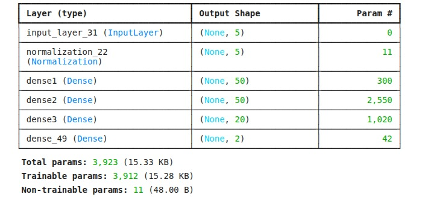

# Technical Documentation for the ML Pipeline

## Overview:
The ML pipeline is a model we built and trained to simply take in 5 data points which are the SPO2, Heartbeat rate, Temperature, Age and Gender data and uses it to estimate the blood pressure. We did this because we wanted as much data as possible for the system to be able to give more recommendations on ones health.

We found a dataset on the kaggle data science platform called the vital signs dataset. it has various attributes which were collected for real patients (about 200k records). So we taught which fields could we get out of them which was the 5 earlier mentioned. Then the goal became to establish a relationship between the 5 data points and the blood pressure (both systotlic and diatolic BP).

We made use of tensorflow/keras to build the model and train it using a jupyter notebook. Though we had issues deploying on the python backend hosted on python anywhere because of difference in tensorflow version the model output incompatibility. So we resorted to compressed the entire program on jupyter notebook into a single file "train.py". Then run it on the backend and use the model output for the backend.

## Core Technologies Used:
- Tensorflow/keras ML framework
- Panda python library for loading the data
- Matplotlib we used this during the evaluation of the model.
- Numpy was used for numerical matrix & tensor calcultations

## Model Structure:
The model was a minimal sized model because of the small data size. Having 3 dense layers and 1 data normalization layer, totalling about 4000 params.

## Training:
Due to it being a small model, it can be trained on CPU. I Trained on my PC using a 11th gen core i7 intel processor and it just took about 1hr 30mins to train 20 epochs.

## Replication Instruction
- install tensorflow on your system (cpu version).
- As easy as python3 train.py (Wait till its done).
- The model.h5 file will be store in the same directory.