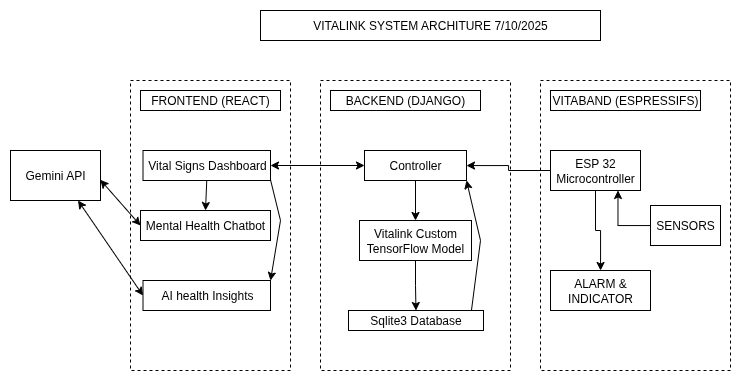

# Official Technical Documentation Of the CODEFEST HACKATHON 2025 TEAM VITALINK Project

## Team Members
- **Ohieku Eneji Peacemaker**
- **Makanjuola Emmanuel Iseoluwa**
- **Onyeka Joshua Ituma**
- **Ituma Chidi Mathayas**

## Overview:
Out of the 24 stipulated lists of problems by CodefestNG, we seek to address Mental Health under the health section. In order for computers to make intelligent inferences, suggestions or advice they need lots of data. Hence the quest of more data from the patient order than just prompts from the user, Though the extra data are vitals signs but there is a bidirectional relationship between a persons physical and mental health.

The Vitalink link solution provides mental health support through a specialized chatbot built on gemini with multilingual support in indigenous languages such as Hausa, Igbo, Yoruba and Pidgin English. The chatbot is also aware of your vital signs which makes it able to detect abnormal condiions and give recommendations. We also built a wearable device during the hackathon between day 5&6 that gets those vital signs and reports it to or backend server. The frontend reports those data as they are assigned to users. So the platform allows you to assess the mental health support without the use of the device but using the device helps the system get an holistic view on your health.

## Core Technologies Used
- React Javascript Frontend Framework.
- Django Python Backend Framework.
- C++ (Arduino)
- Espressifs Systems SDK for programming of the microconroller.
- KiCAD for the design of the electronics prototype.
- TensorFlow Python ML framework for the building and Training of our custom model used to estimate the Blood pressure.
- [Kaggle Vital signs Dataset](https://www.kaggle.com/datasets/nasirayub2/human-vital-sign-dataset), the dataset of about 200k records used to train the model.

## Contents
The documentation of the full project will be broken down into their subcomponents each giving details.
- [ML Pipeline]()
- [Backend]()
- [Vitaband Device]()
- [Frontend]()

## System Architecture:
The entire system architecture can be summarised with this diagram.

This illustrates how the entire system works together.

## Vision & Future Improvements

## Special Thanks

