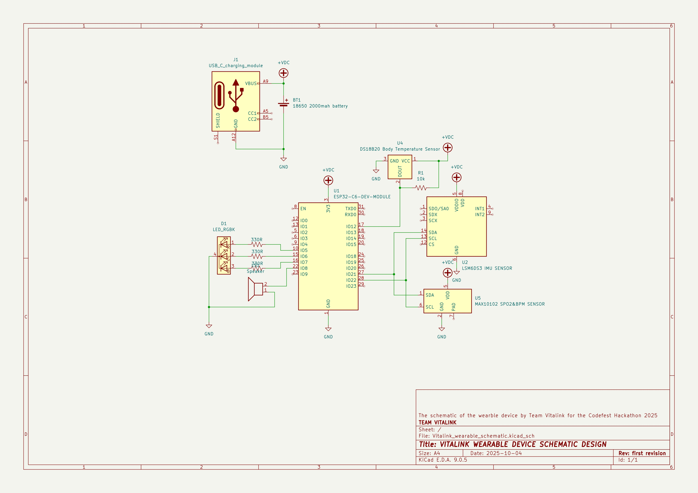

# Technical Documentation Of the vitalink Wearable device (Vitaband)

## Overview:
The wearable device makes use of a powerful microcontroller, The ESP32 C6 which has IOT support which makes it possible for it to communicate with the backend; publishing the sensory data it gets and its able to locally make alarm when the health data is abnormal.

The wearable uses a rechargable battery which is estimated based on current draw to have a standby time of about 15-20hours. The device uses a temperature sensor, a pulse oximeter (SPO2), an Heartbeat rate sensor, a motion sensor with just 2 actuators an RGB led and a piezo buzzer.

The electronics was prototyped on a soft pad and all connections soldered and well protected to ensure safety. The electronics setup was then put into a blood pressure cuff so it can be worn on the arm.

This was the first attempt at this which turn out to be success. Though it benefited from experience with other IOT projects and device prototyping.

## SCHEMATIC DESIGN
The schematice design which we made during the day 4 of the hackathon using an open source electronic CAD software KiCAD. It shows the connection and plan which was followed in the construction of the device.

## Materials Used & Costs
The materials used were of-the-shelf components which got most of them on the day 4 of the hackathon.

| Material | Qty | Cost (N) |
|---|---|---|
|ESP32 C6 MCU| 1| 11000|
|RGB LED| 1 | 100|
|330 ohms resistor| 3 | 90|
|10k ohms resistor| 1 | 40|
|Blood Pressure Cuff XL|1 | 6500|
|Buzzer| 1 | 200|
|2000mah li-ion battery| 1 | 1500|
|1S type-c Battery Charging module| 1 | 1900|
|MAX30102 SPO2&BPM sensor| 1| 3500|
|DS18B20 Temperature Sensor| 1| 2700|
|LSM6DS3 IMU motion sensor| 1 | 3700|
|Total|| 31230|

## Firmware:
This is the program that runs on the microcontroller that manages all the activities of the devices from reading data from the sensor using I2C protocol for the IMU,SPO2&BPM sensor and OneWire Protocal for the Temperature sensor. The program using Arduino C++ (a slight C++ variant designed for the microcontrollers) written with the Arduino IDE.

## Libraries Used:
- OneWire Library (for Onewire Protocol).
- Wire Library (for I2C protocol communication).
- DFROBOT library for the MAX30102 sensor
- Dallas Temperature library for ensuring stable readings and conversion/calibration of temperature values.
- Espressif SDK provided as a board manager which make is possible to interface with the hardware features of the microcontroller such as WIFI, GPIO etc.

## Assembly:
This are just images showing the build process.
