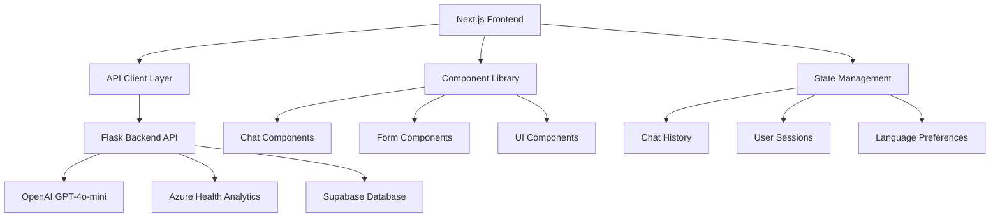

# HealthMate AI Frontend 🖥️

**Modern Next.js Healthcare Interface with AI-Po## 🏗️ Architecture



## 📋 Prerequisites

- **Node.js**: Version 18.17 or higher
- **Package Manager**: npm, yarn, or pnpm
- **Backend**: HealthMate AI Flask backend running
- **Git**: For version control

## ⚙️ Quick Start

### 1. Clone & Navigate
```bash
git clone <repository-url>
cd frontend-nextjs
```

### 2. Install Dependencies
```bash
npm install
# or
yarn install
# or
pnpm install
```

### 3. Environment Configuration
Create a `.env.local` file:
```env
# Backend API Configuration
NEXT_PUBLIC_API_URL=http://localhost:5000
NEXT_PUBLIC_API_TIMEOUT=30000

# Application Configuration
NEXT_PUBLIC_APP_NAME=HealthMate AI
NEXT_PUBLIC_APP_VERSION=1.0.0

# Feature Flags
NEXT_PUBLIC_ENABLE_CHAT_HISTORY=true
NEXT_PUBLIC_ENABLE_VOICE_INPUT=false
NEXT_PUBLIC_ENABLE_OFFLINE_MODE=false

# Analytics (Optional)
NEXT_PUBLIC_GA_TRACKING_ID=your-google-analytics-id
```

### 4. Start Development Server
```bash
npm run dev
# or
yarn dev
# or
pnpm dev
```

### 5. Access Application
Open [http://localhost:3000](http://localhost:3000) in your browser

## 📁 Project Structure

```
frontend-nextjs/
├── 📱 src/
│   ├── 🎯 app/                     # Next.js 14 App Router
│   │   ├── globals.css            # Global Tailwind styles
│   │   ├── layout.tsx             # Root layout with providers
│   │   ├── page.tsx              # Landing page component
│   │   ├── loading.tsx           # Global loading component
│   │   ├── error.tsx             # Global error boundary
│   │   ├── 💬 chat/
│   │   │   ├── page.tsx          # Main chat interface
│   │   │   ├── layout.tsx        # Chat-specific layout
│   │   │   └── components/       # Chat UI components
│   │   ├── 🔍 symptoms/
│   │   │   ├── page.tsx          # Symptom checker form
│   │   │   ├── results/          # Analysis results pages
│   │   │   └── components/       # Symptom-specific components
│   │   ├── 📚 awareness/
│   │   │   ├── page.tsx          # Health awareness hub
│   │   │   ├── [category]/       # Dynamic category pages
│   │   │   └── components/       # Awareness components
│   │   ├── 📖 history/
│   │   │   ├── page.tsx          # Chat history viewer
│   │   │   └── components/       # History components
│   │   └── 🆘 emergency/
│   │       ├── page.tsx          # Emergency contact info
│   │       └── components/       # Emergency components
│   ├── 🧩 components/             # Shared components
│   │   ├── ui/                   # Basic UI components
│   │   │   ├── button.tsx        # Reusable button component
│   │   │   ├── input.tsx         # Form input component
│   │   │   ├── card.tsx          # Card container component
│   │   │   ├── modal.tsx         # Modal dialog component
│   │   │   └── spinner.tsx       # Loading spinner
│   │   ├── chat/                 # Chat-specific components
│   │   │   ├── message.tsx       # Chat message component
│   │   │   ├── input-field.tsx   # Chat input component
│   │   │   ├── typing-indicator.tsx
│   │   │   └── conversation-list.tsx
│   │   ├── forms/                # Form components
│   │   │   ├── symptom-form.tsx  # Symptom input form
│   │   │   ├── contact-form.tsx  # Contact form
│   │   │   └── feedback-form.tsx # User feedback form
│   │   ├── layout/               # Layout components
│   │   │   ├── header.tsx        # App header/navigation
│   │   │   ├── footer.tsx        # App footer
│   │   │   ├── sidebar.tsx       # Navigation sidebar
│   │   │   └── breadcrumb.tsx    # Breadcrumb navigation
│   │   └── providers/            # Context providers
│   │       ├── chat-provider.tsx # Chat state management
│   │       ├── theme-provider.tsx# Theme/dark mode
│   │       └── language-provider.tsx # Multi-language
│   ├── 🔧 lib/                   # Utility libraries
│   │   ├── api.ts               # API client with error handling
│   │   ├── utils.ts             # Common utility functions
│   │   ├── constants.ts         # App constants
│   │   ├── validations.ts       # Form validation schemas
│   │   └── types/               # TypeScript type definitions
│   │       ├── api.ts           # API response types
│   │       ├── chat.ts          # Chat-related types
│   │       ├── health.ts        # Health data types
│   │       └── common.ts        # Common/shared types
│   ├── 🎣 hooks/                # Custom React hooks
│   │   ├── use-chat.ts          # Chat functionality hook
│   │   ├── use-api.ts           # API interaction hook
│   │   ├── use-local-storage.ts # Local storage hook
│   │   ├── use-debounce.ts      # Debounce hook
│   │   └── use-language.ts      # Language switching hook
│   └── 🎨 styles/               # Additional styling
│       ├── globals.css          # Global CSS overrides
│       ├── components.css       # Component-specific styles
│       └── animations.css       # Custom animations
├── 🌍 public/                   # Static assets
│   ├── icons/                   # App icons and favicons
│   ├── images/                  # Static images
│   ├── locales/                 # Translation files
│   └── manifest.json            # PWA manifest
├── ⚙️ config/                   # Configuration files
│   ├── next.config.js           # Next.js configuration
│   ├── tailwind.config.js       # Tailwind CSS configuration
│   ├── tsconfig.json            # TypeScript configuration
│   └── eslint.config.js         # ESLint configuration
├── 🧪 __tests__/                # Test files
│   ├── components/              # Component tests
│   ├── pages/                   # Page tests
│   ├── utils/                   # Utility function tests
│   └── setup.ts                 # Test setup configuration
├── 📚 docs/                     # Documentation
│   ├── deployment.md            # Deployment guide
│   ├── components.md            # Component documentation
│   └── api-integration.md       # API integration guide
├── package.json                 # Dependencies and scripts
├── yarn.lock                    # Dependency lock file
└── README.md                    # This file
```s**

[](https://nextjs.org/)
[](https://www.typescriptlang.org/)
[](https://tailwindcss.com/)
[](https://reactjs.org/)

## 📖 Overview

The HealthMate AI Frontend is a modern, responsive web application built with Next.js and TypeScript that provides an intuitive interface for AI-powered health analysis, symptom checking, and health awareness content. It features a clean, accessible design optimized for healthcare interactions.

## � Key Features

### 🎨 Modern User Interface
- **Responsive Design**: Mobile-first approach with Tailwind CSS
- **Accessible**: WCAG 2.1 compliant with proper contrast and navigation
- **Clean Aesthetics**: Healthcare-focused design with intuitive navigation
- **Fast Loading**: Optimized for performance with Next.js SSR/SSG

### 🤖 AI Health Chat
- **Interactive Conversations**: Real-time chat interface with AI health assistant
- **Conversation History**: Persistent chat sessions with message tracking
- **Typing Indicators**: Real-time feedback during AI processing
- **Multi-turn Conversations**: Context-aware follow-up questions

### 🔍 Symptom Analysis
- **Intelligent Form**: User-friendly symptom input with validation
- **Real-time Analysis**: Instant AI-powered symptom evaluation
- **Risk Assessment**: Visual indicators for health condition severity
- **Personalized Recommendations**: Tailored health advice and next steps

### 📚 Health Awareness Hub
- **Dynamic Content**: AI-generated health articles across multiple categories
- **Interactive Categories**: Easy navigation through health topics
- **Evidence-Based Information**: Articles with proper citations and sources
- **Search & Filter**: Find relevant health information quickly

### 🌐 Multilingual Support
- **Language Selection**: Support for 5 languages including Nigerian languages
- **Real-time Translation**: Seamless content translation
- **Cultural Context**: Localized health information and recommendations

## 📁 Project Structure

```
frontend-nextjs/
├── src/
│   ├── components/         # Reusable UI components
│   │   ├── Layout.tsx     # Main layout wrapper
│   │   └── Navigation.tsx # Navigation component
│   ├── lib/               # Utility functions and configurations
│   │   ├── api.ts         # API client for backend communication
│   │   ├── config.ts      # App configuration
│   │   └── utils.ts       # Utility functions
│   ├── pages/             # Next.js pages
│   │   ├── _app.tsx       # App wrapper
│   │   ├── index.tsx      # Home page
│   │   ├── chat.tsx       # AI chat interface
│   │   ├── symptoms.tsx   # Symptom checker
│   │   ├── awareness.tsx  # Health awareness content
│   │   ├── tips.tsx       # Health tips
│   │   ├── first-aid.tsx  # First aid guides
│   │   └── history.tsx    # Chat history
│   ├── styles/            # Global styles
│   │   └── globals.css    # Tailwind CSS imports and custom styles
│   └── types/             # TypeScript type definitions
│       └── index.ts       # Shared type definitions
├── public/                # Static assets
├── package.json           # Dependencies and scripts
├── tailwind.config.js     # Tailwind CSS configuration
├── tsconfig.json          # TypeScript configuration
└── next.config.js         # Next.js configuration
```

## 🛠 Installation & Setup

### Prerequisites

- Node.js 18+ 
- npm or yarn package manager

### Quick Start

1. **Install dependencies:**
   ```bash
   npm install
   ```

2. **Start development server:**
   ```bash
   npm run dev
   ```

3. **Open in browser:**
   Navigate to [http://localhost:3000](http://localhost:3000)

### Available Scripts

- `npm run dev` - Start development server
- `npm run build` - Build for production
- `npm run start` - Start production server
- `npm run lint` - Run ESLint
- `npm run type-check` - Run TypeScript type checking

## 🎨 UI Components

### Navigation
- Responsive navigation bar with mobile sidebar
- Active page highlighting
- Brand logo and disclaimer

### Pages
- **Home**: Hero section with feature cards and emergency resources
- **Chat**: AI-powered health consultation interface
- **Symptoms**: Symptom checker with health analysis
- **Awareness**: Educational health content by category
- **Tips**: Daily health tips and wellness advice
- **First Aid**: Emergency response guides
- **History**: Previous chat conversations

## 🔌 API Integration

The frontend communicates with multiple backend services:

- **Main Backend**: Flask API for health analysis (`http://127.0.0.1:5000`)
- **Triage Service**: Advanced medical triage (`https://triagecall.vercel.app`)

### API Client Features

- Automatic error handling
- TypeScript interfaces for responses
- Health analysis and symptom checking
- Multi-language support
- Triage analysis for emergency detection

## 🎯 Key Features Implementation

### AI Chat Interface
- Real-time messaging with typing indicators
- Emergency situation detection
- Diagnosis panel for urgent cases
- Prompt suggestions for user guidance

### Responsive Design
- Mobile-first approach using Tailwind CSS
- Breakpoint-based responsive layouts
- Touch-friendly interactive elements
- Optimized for various screen sizes

### Accessibility
- Semantic HTML structure
- ARIA labels and roles
- Keyboard navigation support
- Color contrast compliance

## 🚀 Production Deployment

### Build for Production

```bash
npm run build
```

### Deployment Options

1. **Vercel** (Recommended)
   ```bash
   vercel --prod
   ```

2. **Netlify**
   ```bash
   npm run build
   # Upload dist folder to Netlify
   ```

3. **Custom Server**
   ```bash
   npm run build
   npm start
   ```

## 🔧 Configuration

### Environment Variables

Create a `.env.local` file:

```env
# API URLs
NEXT_PUBLIC_API_BASE_URL=https://your-backend-url.com
NEXT_PUBLIC_TRIAGE_API_URL=https://triagecall.vercel.app

# App Configuration
NEXT_PUBLIC_APP_VERSION=2.0
```

### Tailwind CSS Customization

The project uses a custom Tailwind configuration with:
- Custom color palette matching the original design
- Extended spacing and typography scales
- Custom animation classes
- Component-specific utilities

## 📱 Mobile Experience

- Responsive design optimized for mobile devices
- Touch-friendly interface elements
- Mobile-specific navigation patterns
- Optimized loading performance

## 🔒 Security & Privacy

- No sensitive data stored in browser storage
- API communication over HTTPS
- Input sanitization for user data
- Privacy-focused design decisions

## 🐛 Troubleshooting

### Common Issues

1. **TypeScript Errors**: Run `npm run type-check` to identify type issues
2. **Build Failures**: Check for syntax errors and missing dependencies
3. **API Connection**: Verify backend services are running
4. **Styles Not Loading**: Ensure Tailwind CSS is properly configured

### Development Tips

- Use browser dev tools for responsive design testing
- Check console for runtime errors
- Verify API responses in Network tab
- Test accessibility with screen readers

## 🤝 Contributing

1. Follow the existing code structure and naming conventions
2. Use TypeScript for all new components
3. Implement responsive design patterns
4. Test on multiple devices and screen sizes
5. Maintain accessibility standards

## 📄 License

This project is part of the CJID Hackathon HealthMate AI initiative.

## 🔗 Related Projects

- [Backend API](../backend/) - Flask-based health analysis API
- [Triage Service](../triage-call/) - Advanced medical triage system
- [Original Frontend](../frontend/) - Legacy HTML/CSS/JS implementation# Healthmate-AI
