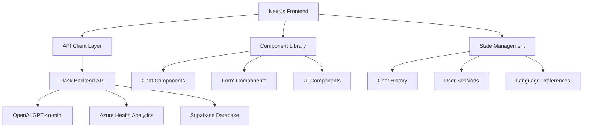

# HealthMate AI Frontend 🖥️

**Modern Next.js Healthcare Interface with AI-Powered Health Analysis**

[](https://nextjs.org/)
[](https://www.typescriptlang.org/)
[](https://tailwindcss.com/)
[](https://reactjs.org/)

## 📖 Overview

The HealthMate AI Frontend is a modern, responsive web application built with Next.js and TypeScript that provides an intuitive interface for AI-powered health analysis, symptom checking, and health awareness content. It features a clean, accessible design optimized for healthcare interactions with Nigerian language support and culturally sensitive health guidance.

## 🔑 Key Features

### 🎨 Modern User Interface
- **Responsive Design**: Mobile-first approach with Tailwind CSS
- **Accessible**: WCAG 2.1 compliant with proper contrast and navigation
- **Clean Aesthetics**: Healthcare-focused design with intuitive navigation
- **Fast Loading**: Optimized for performance with Next.js SSR/SSG

### 🤖 AI Health Chat
- **Interactive Conversations**: Real-time chat interface with AI health assistant
- **Conversation History**: Persistent chat sessions with Supabase integration
- **Typing Indicators**: Real-time feedback during AI processing
- **Context Awareness**: Multi-turn conversations with health history context

### 🔍 Symptom Analysis
- **Intelligent Form**: User-friendly symptom input with validation
- **Real-time Analysis**: Instant AI-powered symptom evaluation using GPT-4o-mini
- **Risk Assessment**: Visual indicators for health condition severity
- **Personalized Recommendations**: Tailored health advice and next steps

### 📚 Health Awareness Hub
- **Dynamic Content**: AI-generated health articles across multiple categories
- **Interactive Categories**: Easy navigation through health topics
- **Evidence-Based Information**: Articles with proper citations and sources
- **Search & Filter**: Find relevant health information quickly

### 🌐 Multilingual Support
- **Nigerian Languages**: Support for Igbo, Yoruba, Hausa, and Nigerian Pidgin
- **Real-time Translation**: Seamless content translation via Azure Translator
- **Cultural Context**: Localized health information and recommendations
- **Language Persistence**: User language preferences saved across sessions

## 🏗️ Architecture



## 📋 Prerequisites

- **Node.js**: Version 18.17 or higher
- **Package Manager**: npm, yarn, or pnpm
- **Backend**: HealthMate AI Flask backend running on port 5000
- **Git**: For version control

## ⚙️ Quick Start

### 1. Clone & Navigate
```bash
git clone <repository-url>
cd frontend-nextjs
```

### 2. Install Dependencies
```bash
npm install
# or
yarn install
# or
pnpm install
```

### 3. Environment Configuration
Create a `.env.local` file:
```env
# Backend API Configuration
NEXT_PUBLIC_API_URL=http://localhost:5000
NEXT_PUBLIC_API_TIMEOUT=30000

# Application Configuration
NEXT_PUBLIC_APP_NAME=HealthMate AI
NEXT_PUBLIC_APP_VERSION=1.0.0

# Feature Flags
NEXT_PUBLIC_ENABLE_CHAT_HISTORY=true
NEXT_PUBLIC_ENABLE_VOICE_INPUT=false
NEXT_PUBLIC_ENABLE_OFFLINE_MODE=false

# Triage Service (Optional)
NEXT_PUBLIC_TRIAGE_API_URL=https://triagecall.vercel.app

# Analytics (Optional)
NEXT_PUBLIC_GA_TRACKING_ID=your-google-analytics-id
```

### 4. Start Development Server
```bash
npm run dev
# or
yarn dev
# or
pnpm dev
```

### 5. Access Application
Open [http://localhost:3000](http://localhost:3000) in your browser

## 📁 Project Structure

```
frontend-nextjs/
├── 📱 src/
│   ├── 🎯 app/                     # Next.js 14 App Router
│   │   ├── globals.css            # Global Tailwind styles
│   │   ├── layout.tsx             # Root layout with providers
│   │   ├── page.tsx              # Landing page component
│   │   ├── loading.tsx           # Global loading component
│   │   ├── error.tsx             # Global error boundary
│   │   ├── 💬 chat/
│   │   │   ├── page.tsx          # Main chat interface
│   │   │   ├── layout.tsx        # Chat-specific layout
│   │   │   └── components/       # Chat UI components
│   │   ├── 🔍 symptoms/
│   │   │   ├── page.tsx          # Symptom checker form
│   │   │   ├── results/          # Analysis results pages
│   │   │   └── components/       # Symptom-specific components
│   │   ├── 📚 awareness/
│   │   │   ├── page.tsx          # Health awareness hub
│   │   │   ├── [category]/       # Dynamic category pages
│   │   │   └── components/       # Awareness components
│   │   ├── 📖 history/
│   │   │   ├── page.tsx          # Chat history viewer
│   │   │   └── components/       # History components
│   │   └── 🆘 emergency/
│   │       ├── page.tsx          # Emergency contact info
│   │       └── components/       # Emergency components
│   ├── 🧩 components/             # Shared components
│   │   ├── ui/                   # Basic UI components
│   │   │   ├── button.tsx        # Reusable button component
│   │   │   ├── input.tsx         # Form input component
│   │   │   ├── card.tsx          # Card container component
│   │   │   ├── modal.tsx         # Modal dialog component
│   │   │   └── spinner.tsx       # Loading spinner
│   │   ├── chat/                 # Chat-specific components
│   │   │   ├── message.tsx       # Chat message component
│   │   │   ├── input-field.tsx   # Chat input component
│   │   │   ├── typing-indicator.tsx
│   │   │   └── conversation-list.tsx
│   │   ├── forms/                # Form components
│   │   │   ├── symptom-form.tsx  # Symptom input form
│   │   │   ├── contact-form.tsx  # Contact form
│   │   │   └── feedback-form.tsx # User feedback form
│   │   ├── layout/               # Layout components
│   │   │   ├── header.tsx        # App header/navigation
│   │   │   ├── footer.tsx        # App footer
│   │   │   ├── sidebar.tsx       # Navigation sidebar
│   │   │   └── breadcrumb.tsx    # Breadcrumb navigation
│   │   └── providers/            # Context providers
│   │       ├── chat-provider.tsx # Chat state management
│   │       ├── theme-provider.tsx# Theme/dark mode
│   │       └── language-provider.tsx # Multi-language
│   ├── 🔧 lib/                   # Utility libraries
│   │   ├── api.ts               # API client with error handling
│   │   ├── utils.ts             # Common utility functions
│   │   ├── constants.ts         # App constants
│   │   ├── validations.ts       # Form validation schemas
│   │   └── types/               # TypeScript type definitions
│   │       ├── api.ts           # API response types
│   │       ├── chat.ts          # Chat-related types
│   │       ├── health.ts        # Health data types
│   │       └── common.ts        # Common/shared types
│   ├── 🎣 hooks/                # Custom React hooks
│   │   ├── use-chat.ts          # Chat functionality hook
│   │   ├── use-api.ts           # API interaction hook
│   │   ├── use-local-storage.ts # Local storage hook
│   │   ├── use-debounce.ts      # Debounce hook
│   │   └── use-language.ts      # Language switching hook
│   └── 🎨 styles/               # Additional styling
│       ├── globals.css          # Global CSS overrides
│       ├── components.css       # Component-specific styles
│       └── animations.css       # Custom animations
├── 🌍 public/                   # Static assets
│   ├── icons/                   # App icons and favicons
│   ├── images/                  # Static images
│   ├── locales/                 # Translation files
│   └── manifest.json            # PWA manifest
├── ⚙️ config/                   # Configuration files
│   ├── next.config.js           # Next.js configuration
│   ├── tailwind.config.js       # Tailwind CSS configuration
│   ├── tsconfig.json            # TypeScript configuration
│   └── eslint.config.js         # ESLint configuration
├── 🧪 __tests__/                # Test files
│   ├── components/              # Component tests
│   ├── pages/                   # Page tests
│   ├── utils/                   # Utility function tests
│   └── setup.ts                 # Test setup configuration
├── 📚 docs/                     # Documentation
│   ├── deployment.md            # Deployment guide
│   ├── components.md            # Component documentation
│   └── api-integration.md       # API integration guide
├── package.json                 # Dependencies and scripts
├── yarn.lock                    # Dependency lock file
└── README.md                    # This file
```

## 🛠️ Development Scripts

```bash
# Development
npm run dev              # Start development server with hot reload
npm run dev:debug        # Start with debugging enabled
npm run dev:turbo        # Start with Turbo mode (experimental)

# Building & Production
npm run build            # Build optimized production bundle
npm run build:analyze    # Build with bundle analyzer
npm run start            # Start production server
npm run export           # Export static files

# Code Quality
npm run lint             # Run ESLint with auto-fix
npm run lint:check       # Check linting without fixes
npm run type-check       # Run TypeScript compiler checks
npm run format           # Format code with Prettier
npm run format:check     # Check code formatting

# Testing
npm run test             # Run unit tests
npm run test:watch       # Run tests in watch mode
npm run test:coverage    # Generate coverage report
npm run test:e2e         # Run end-to-end tests
npm run test:integration # Run integration tests

# Maintenance
npm run clean            # Clean build artifacts
npm run deps:update      # Update dependencies
npm run deps:audit       # Security audit
```

## 🧩 Core Components

### 💬 Chat System (`src/app/chat/`)
```typescript
// Chat Interface Features
- Real-time messaging with WebSocket fallback
- Message persistence with Supabase integration
- Typing indicators and loading animations
- Message threading and context awareness
- Emergency detection and escalation
- Multi-language chat support

// Key Components
- ChatContainer: Main chat interface wrapper
- MessageList: Displays conversation history
- MessageInput: User input with emoji support
- TypingIndicator: Shows AI processing status
- EmergencyAlert: Critical health situation warnings
```

### 🔍 Symptom Analysis (`src/app/symptoms/`)
```typescript
// Symptom Checker Features
- Multi-step interactive form
- Smart symptom suggestions
- Severity assessment sliders
- Body part selection interface
- Medical history integration
- Risk factor analysis with AI

// Key Components
- SymptomForm: Multi-step form wizard
- BodyDiagram: Interactive anatomy selector
- SeveritySlider: Symptom intensity input
- ResultsDisplay: Analysis visualization
- RecommendationCard: Action suggestions
```

### 📚 Health Awareness (`src/app/awareness/`)
```typescript
// Health Content Features
- Dynamic content generation via AI
- Category-based organization (General, Women's Health, etc.)
- Search and filtering capabilities
- Bookmark and favorites system
- Social sharing integration
- Content recommendation engine

// Key Components
- ContentGrid: Article listing layout
- ArticleCard: Individual content preview
- CategoryFilter: Content filtering system
- SearchBar: Full-text search interface
- BookmarkButton: Save articles for later
```

### 📖 History Management (`src/app/history/`)
```typescript
// History Features
- Conversation timeline view
- Export to PDF/JSON formats
- Advanced search and filtering
- Data privacy controls
- Conversation analytics
- Backup and restore functionality

// Key Components
- HistoryList: Conversation timeline
- ConversationPreview: Chat summary cards
- ExportDialog: Data export options
- SearchFilter: History search interface
- PrivacyControls: Data management options
```

## 🎨 Design System

### Color Palette
```css
/* Healthcare Primary Colors */
:root {
  --primary-50: #f0f9ff;     /* Light blue backgrounds */
  --primary-500: #3b82f6;    /* Primary actions */
  --primary-600: #2563eb;    /* Hover states */
  --primary-900: #1e3a8a;    /* Dark text */

  /* Healthcare Semantic Colors */
  --success: #10b981;        /* Positive health indicators */
  --warning: #f59e0b;        /* Caution/moderate risk */
  --error: #ef4444;          /* High risk/critical */
  --info: #06b6d4;           /* Informational content */

  /* Neutral Grays */
  --gray-50: #f9fafb;        /* Background */
  --gray-100: #f3f4f6;       /* Cards/containers */
  --gray-500: #6b7280;       /* Secondary text */
  --gray-900: #111827;       /* Primary text */
}
```

### Typography Scale
```css
/* Font Sizes */
.text-xs { font-size: 0.75rem; }     /* 12px - Captions */
.text-sm { font-size: 0.875rem; }    /* 14px - Small text */
.text-base { font-size: 1rem; }      /* 16px - Body text */
.text-lg { font-size: 1.125rem; }    /* 18px - Large body */
.text-xl { font-size: 1.25rem; }     /* 20px - Headings */
.text-2xl { font-size: 1.5rem; }     /* 24px - Subheadings */
.text-3xl { font-size: 1.875rem; }   /* 30px - Page titles */

/* Font Weights */
.font-normal { font-weight: 400; }    /* Regular text */
.font-medium { font-weight: 500; }    /* Emphasized text */
.font-semibold { font-weight: 600; }  /* Subheadings */
.font-bold { font-weight: 700; }      /* Headings */
```

### Component Guidelines
```typescript
// Button Variants
type ButtonVariant = 
  | 'primary'      // Main actions (submit, continue)
  | 'secondary'    // Secondary actions (cancel, back)
  | 'outline'      // Alternative actions
  | 'ghost'        // Subtle actions
  | 'emergency'    // Critical/emergency actions

// Spacing System (Tailwind-based)
const spacing = {
  xs: '0.25rem',   // 4px
  sm: '0.5rem',    // 8px
  md: '1rem',      // 16px
  lg: '1.5rem',    // 24px
  xl: '2rem',      // 32px
  '2xl': '3rem',   // 48px
}
```

## 🔌 API Integration Layer

### API Client (`src/lib/api.ts`)
```typescript
// Configuration
const API_CONFIG = {
  baseURL: process.env.NEXT_PUBLIC_API_URL || 'http://localhost:5000',
  timeout: 30000,
  retries: 3,
  retryDelay: 1000,
}

// Key Features
- Automatic retry logic with exponential backoff
- Request/response interceptors for auth
- Error boundary integration
- Loading state management
- Request cancellation support
- Response caching with SWR integration
```

### API Endpoints
```typescript
// Chat Endpoints
POST /api/chat                    # Send message to AI assistant
GET  /api/chat/history           # Retrieve conversation history
POST /api/chat/feedback          # Submit message feedback
DELETE /api/chat/history/:id     # Delete conversation

// Health Analysis
POST /api/health/analyze         # Analyze symptoms with AI
GET  /api/health/history         # Get analysis history
POST /api/health/emergency       # Emergency triage assessment
GET  /api/health/recommendations # Get health recommendations

// Content & Awareness
GET  /api/content/awareness      # Health awareness articles
GET  /api/content/tips          # Daily health tips
GET  /api/content/search        # Content search
GET  /api/content/categories    # Available categories

// User Management
POST /api/user/session          # Create/update user session
GET  /api/user/preferences      # User preferences
POST /api/user/language         # Update language preference
POST /api/user/feedback         # Submit user feedback

// Translation Services
POST /api/translate             # Translate content
GET  /api/languages            # Available languages
```

## 🌐 Internationalization (i18n)

### Supported Languages
```json
{
  "en": "English (Default)",
  "ig": "Igbo",
  "yo": "Yoruba", 
  "ha": "Hausa",
  "pcm": "Nigerian Pidgin"
}
```

### Translation System
```typescript
// Hook Usage
const { t, language, setLanguage } = useLanguage();

// Component Usage
<Button>{t('common.continue')}</Button>
<Text>{t('chat.welcome_message')}</Text>

// Namespace Organization
common.json     # Shared UI text (buttons, labels, etc.)
chat.json       # Chat interface messages
symptoms.json   # Symptom checker text
awareness.json  # Health content
errors.json     # Error messages
navigation.json # Menu and navigation items
```

### Cultural Localization Features
- **Medical Terminology**: Appropriate local medical terms and concepts
- **Cultural Context**: Culturally sensitive health advice and recommendations
- **Number/Date Formats**: Localized formatting for dates, times, and numbers
- **Currency**: Local currency for any cost references (e.g., consultation fees)
- **Emergency Contacts**: Region-specific emergency service numbers

## 📱 Responsive Design Strategy

### Breakpoint System
```css
/* Mobile First Approach */
sm: '640px',   /* Small tablets and large phones */
md: '768px',   /* Tablets */
lg: '1024px',  /* Small desktops and laptops */
xl: '1280px',  /* Large desktops */
'2xl': '1536px' /* Extra large screens */
```

### Device-Specific Features
```typescript
// Mobile Optimizations (< 768px)
- Touch-friendly button sizes (minimum 44px)
- Swipe gestures for navigation
- Pull-to-refresh functionality
- Native-like animations and transitions
- Optimized keyboard behavior
- Collapsible navigation menu

// Tablet Enhancements (768px - 1024px)
- Sidebar navigation panel
- Multi-column layouts for content
- Enhanced touch interactions
- Landscape orientation support
- Picture-in-picture chat window

// Desktop Features (> 1024px)
- Keyboard shortcuts and hotkeys
- Hover states and tooltips
- Multi-window support
- Advanced filtering and search options
- Drag-and-drop functionality
```

## 🧪 Testing Strategy

### Unit Testing (`__tests__/components/`)
```bash
# Component Testing with Jest & React Testing Library
npm run test:unit

# Coverage Requirements
- Components: 90%+ coverage
- Utilities: 95%+ coverage
- API clients: 85%+ coverage
- Hooks: 90%+ coverage
```

### Integration Testing (`__tests__/integration/`)
```bash
# API Integration Tests
npm run test:integration

# Test Scenarios
- Complete user flows (registration to chat completion)
- API error handling and fallbacks
- State management across components
- Cross-component interactions
- Language switching functionality
```

### End-to-End Testing (`__tests__/e2e/`)
```bash
# Playwright E2E Tests
npm run test:e2e

# Critical User Journeys
- Complete health consultation workflow
- Symptom analysis from input to results
- Language switching and content translation
- Chat history management and export
- Emergency situation detection and response
```

### Accessibility Testing
```bash
# Accessibility Compliance Tests
npm run test:a11y

# WCAG 2.1 Compliance Checks
- Keyboard navigation testing
- Screen reader compatibility
- Color contrast validation
- Focus management verification
- ARIA attributes validation
```

## 🚀 Deployment Options

### 🎯 Vercel (Recommended)
```bash
# Automatic Deployment Setup
1. Connect GitHub repository to Vercel
2. Configure environment variables in dashboard
3. Enable automatic deployments on push to main
4. Configure custom domain (optional)

# Environment Variables for Vercel
NEXT_PUBLIC_API_URL=https://your-backend-domain.com
NEXT_PUBLIC_VERCEL_URL=auto-populated-by-vercel
NEXT_PUBLIC_APP_VERSION=1.0.0
```

### 🐳 Docker Deployment
```dockerfile
# Multi-stage Docker build for production
FROM node:18-alpine AS builder
WORKDIR /app

# Install dependencies
COPY package*.json ./
RUN npm ci --only=production && npm cache clean --force

# Build application
COPY . .
RUN npm run build

# Production stage
FROM node:18-alpine AS runner
WORKDIR /app

# Create non-root user
RUN addgroup --system --gid 1001 nodejs
RUN adduser --system --uid 1001 nextjs

# Copy built application
COPY --from=builder /app/public ./public
COPY --from=builder /app/.next/standalone ./
COPY --from=builder /app/.next/static ./.next/static

USER nextjs
EXPOSE 3000
ENV PORT 3000

CMD ["node", "server.js"]
```

```bash
# Build and Run Docker Container
docker build -t healthmate-frontend:latest .
docker run -p 3000:3000 --env-file .env.production healthmate-frontend:latest

# Docker Compose (with backend)
version: '3.8'
services:
  frontend:
    build: .
    ports:
      - "3000:3000"
    environment:
      - NEXT_PUBLIC_API_URL=http://backend:5000
    depends_on:
      - backend
```

### ☁️ AWS/Azure Deployment
```bash
# Static Site Generation for CDN deployment
npm run build
npm run export

# AWS S3 + CloudFront
aws s3 sync out/ s3://your-bucket-name --delete
aws cloudfront create-invalidation --distribution-id YOUR-DISTRIBUTION-ID --paths "/*"

# Azure Static Web Apps
az staticwebapps deploy --name your-app-name --resource-group your-rg --source out/
```

### 🔧 Custom Server Deployment
```bash
# PM2 Process Manager
npm install -g pm2
npm run build

# Create PM2 ecosystem file
echo "module.exports = {
  apps: [{
    name: 'healthmate-frontend',
    script: 'npm',
    args: 'start',
    instances: 'max',
    exec_mode: 'cluster',
    env: {
      NODE_ENV: 'production',
      PORT: 3000
    }
  }]
}" > ecosystem.config.js

# Start with PM2
pm2 start ecosystem.config.js
pm2 save
pm2 startup
```

## 🔧 Advanced Configuration

### Next.js Configuration (`next.config.js`)
```javascript
/** @type {import('next').NextConfig} */
const nextConfig = {
  // Performance Optimizations
  experimental: {
    optimizeCss: true,
    optimizePackageImports: ['@heroicons/react'],
  },
  swcMinify: true,
  compress: true,
  
  // Image Optimization
  images: {
    domains: ['your-cdn-domain.com'],
    formats: ['image/webp', 'image/avif'],
    minimumCacheTTL: 31536000, // 1 year
  },
  
  // Security Headers
  async headers() {
    return [
      {
        source: '/(.*)',
        headers: [
          {
            key: 'Content-Security-Policy',
            value: `
              default-src 'self';
              script-src 'self' 'unsafe-eval' 'unsafe-inline';
              style-src 'self' 'unsafe-inline';
              img-src 'self' data: https:;
              font-src 'self' data:;
              connect-src 'self' ${process.env.NEXT_PUBLIC_API_URL};
            `.replace(/\s+/g, ' ').trim()
          },
          {
            key: 'X-Frame-Options',
            value: 'DENY'
          },
          {
            key: 'X-Content-Type-Options',
            value: 'nosniff'
          },
          {
            key: 'Referrer-Policy',
            value: 'origin-when-cross-origin'
          }
        ]
      }
    ]
  },
  
  // API Routes and Rewrites
  async rewrites() {
    return [
      {
        source: '/api/:path*',
        destination: `${process.env.NEXT_PUBLIC_API_URL}/api/:path*`
      }
    ]
  },
  
  // Internationalization
  i18n: {
    locales: ['en', 'ig', 'yo', 'ha', 'pcm'],
    defaultLocale: 'en',
    localeDetection: true,
  },
  
  // PWA Configuration
  pwa: {
    dest: 'public',
    register: true,
    skipWaiting: true,
  }
}

module.exports = nextConfig
```

### Performance Optimization
```typescript
// Code Splitting and Lazy Loading
const LazyComponent = dynamic(() => import('./HeavyComponent'), {
  loading: () => <Spinner className="h-8 w-8" />,
  ssr: false
});

// Bundle Analysis
npm run build:analyze

// Core Web Vitals Targets
- First Contentful Paint (FCP): < 1.5s
- Largest Contentful Paint (LCP): < 2.5s
- Cumulative Layout Shift (CLS): < 0.1
- First Input Delay (FID): < 100ms
- Time to Interactive (TTI): < 3.5s

// Performance Monitoring
import { getCLS, getFID, getFCP, getLCP, getTTFB } from 'web-vitals';

export function reportWebVitals(metric) {
  // Send to analytics service
  console.log(metric);
}
```

### Tailwind CSS Configuration (`tailwind.config.js`)
```javascript
/** @type {import('tailwindcss').Config} */
module.exports = {
  content: [
    './src/pages/**/*.{js,ts,jsx,tsx,mdx}',
    './src/components/**/*.{js,ts,jsx,tsx,mdx}',
    './src/app/**/*.{js,ts,jsx,tsx,mdx}',
  ],
  theme: {
    extend: {
      colors: {
        primary: {
          50: '#f0f9ff',
          500: '#3b82f6',
          600: '#2563eb',
          900: '#1e3a8a',
        },
        success: '#10b981',
        warning: '#f59e0b',
        error: '#ef4444',
        info: '#06b6d4',
      },
      fontFamily: {
        sans: ['Inter', 'sans-serif'],
        mono: ['Fira Code', 'monospace'],
      },
      animation: {
        'fade-in': 'fadeIn 0.5s ease-in-out',
        'slide-up': 'slideUp 0.3s ease-out',
        'pulse-slow': 'pulse 3s infinite',
      },
      keyframes: {
        fadeIn: {
          '0%': { opacity: '0' },
          '100%': { opacity: '1' },
        },
        slideUp: {
          '0%': { transform: 'translateY(20px)', opacity: '0' },
          '100%': { transform: 'translateY(0)', opacity: '1' },
        },
      },
    },
  },
  plugins: [
    require('@tailwindcss/forms'),
    require('@tailwindcss/typography'),
    require('@tailwindcss/aspect-ratio'),
  ],
}
```

## 🔐 Security Implementation

### Data Protection & Privacy
```typescript
// Input Sanitization
import DOMPurify from 'isomorphic-dompurify';

const sanitizeInput = (input: string): string => {
  return DOMPurify.sanitize(input, {
    ALLOWED_TAGS: ['b', 'i', 'em', 'strong'],
    ALLOWED_ATTR: []
  });
};

// XSS Prevention
- All user inputs are sanitized before processing
- Content Security Policy implemented
- Secure cookie handling with httpOnly and secure flags
- HTTPS enforcement in production
- Input validation using Zod schemas
```

### GDPR/CCPA Compliance
```typescript
// Privacy Features
- Cookie consent management system
- Data export functionality (JSON/PDF formats)
- Right to deletion with data purging
- Privacy policy integration
- Audit logging for data access
- User consent tracking and management

// Data Minimization
- Collect only necessary health information
- Anonymous session handling where possible
- Automatic data expiration policies
- Opt-in for non-essential features
```

### Healthcare Data Security
```typescript
// HIPAA Compliance Considerations
- End-to-end encryption for sensitive data
- Secure data transmission (TLS 1.3)
- Access logging and monitoring
- Data breach notification procedures
- User authentication and authorization
- Regular security audits and assessments
```

## 📊 Analytics & Monitoring

### Performance Monitoring
```typescript
// Web Vitals Tracking
import { getCLS, getFID, getFCP, getLCP, getTTFB } from 'web-vitals';

// Error Boundary Integration
class ErrorBoundary extends React.Component {
  componentDidCatch(error, errorInfo) {
    // Log to monitoring service
    console.error('React Error:', error, errorInfo);
  }
}

// Performance Metrics Collection
- Automatic error reporting and alerting
- User session recording (privacy-compliant)
- API response time monitoring
- Bundle size and loading performance tracking
- Real User Monitoring (RUM) integration
```

### User Analytics (Privacy-Respectful)
```typescript
// Anonymous Usage Tracking
- Feature adoption and usage metrics
- Conversion funnel analysis (registration → consultation)
- A/B testing infrastructure for UI improvements
- Health content engagement tracking
- Language preference and switching patterns
- Device and platform usage statistics

// Privacy-First Analytics
- No personal health information in analytics
- Anonymous user identifiers only
- Opt-out mechanisms for all tracking
- GDPR-compliant data retention policies
```

## 🤝 Contributing Guidelines

### Development Workflow
```bash
# 1. Fork and Clone Repository
git clone https://github.com/your-username/healthmate-ai.git
cd healthmate-ai/frontend-nextjs

# 2. Create Feature Branch
git checkout -b feature/amazing-new-feature

# 3. Set Up Development Environment
npm install
cp .env.example .env.local
npm run dev

# 4. Make Changes Following Standards
- Follow ESLint and Prettier configurations
- Write comprehensive tests for new features
- Update documentation for API changes
- Ensure accessibility compliance

# 5. Run Quality Checks
npm run lint
npm run type-check
npm run test
npm run test:e2e

# 6. Submit Pull Request
git add .
git commit -m "feat: add amazing new feature"
git push origin feature/amazing-new-feature
```

### Code Review Checklist
- [ ] **Code Quality**: Follows project conventions and style guide
- [ ] **Testing**: Comprehensive unit and integration tests included
- [ ] **Documentation**: Updated README, API docs, and inline comments
- [ ] **Performance**: No significant impact on Core Web Vitals
- [ ] **Security**: No security vulnerabilities or data exposure
- [ ] **Accessibility**: WCAG 2.1 AA compliance maintained
- [ ] **Mobile**: Responsive design works across all breakpoints
- [ ] **i18n**: Multilingual support maintained for new features

### Commit Convention (Conventional Commits)
```bash
# Types
feat:     # New feature
fix:      # Bug fix
docs:     # Documentation changes
style:    # Code style changes (formatting, etc.)
refactor: # Code refactoring without feature changes
test:     # Adding or updating tests
chore:    # Maintenance tasks

# Examples
feat(chat): add voice input support for mobile users
fix(symptoms): resolve form validation error on submission
docs(api): update integration guide with new endpoints
style(components): format button components with prettier
refactor(hooks): optimize useChat hook performance
test(integration): add comprehensive chat flow tests
chore(deps): update Next.js to latest version
```

## 🆘 Troubleshooting

### Common Development Issues
```bash
# 1. Build Errors
Error: Module not found: Can't resolve 'module-name'
Solution: 
  - Check package.json dependencies
  - Run npm install or yarn install
  - Verify import paths are correct
  - Clear node_modules and reinstall if needed

# 2. API Connection Issues
Error: Network request failed / CORS error
Solution:
  - Verify NEXT_PUBLIC_API_URL is correct
  - Check backend server is running on specified port
  - Ensure CORS is configured in Flask backend
  - Check network connectivity and firewall settings

# 3. Performance Issues
Issue: Slow loading times or poor performance
Solution:
  - Run npm run build:analyze to identify large bundles
  - Implement code splitting for heavy components
  - Optimize images and static assets
  - Enable proper caching headers
  - Use React.memo for expensive components

# 4. TypeScript Errors
Error: Type errors during development
Solution:
  - Run npm run type-check for detailed error info
  - Update type definitions in src/lib/types/
  - Ensure proper typing for API responses
  - Check tsconfig.json configuration

# 5. Styling Issues
Issue: Tailwind classes not working or conflicts
Solution:
  - Verify tailwind.config.js includes all source files
  - Check for CSS specificity conflicts
  - Ensure PostCSS configuration is correct
  - Clear browser cache and restart dev server
```

### Debug Mode & Logging
```bash
# Enable Debug Mode
NEXT_PUBLIC_DEBUG=true npm run dev

# Browser DevTools Debugging
- Network tab: Check API requests and responses
- Console: View JavaScript errors and logs
- Performance tab: Analyze loading performance
- Application tab: Inspect localStorage and sessionStorage

# Performance Analysis
npm run build:analyze
# Opens bundle analyzer in browser

# Lighthouse Audit
npx lighthouse http://localhost:3000 --view
```

### Environment-Specific Issues
```bash
# Development Environment
- Ensure all environment variables are set in .env.local
- Check backend server is running and accessible
- Verify Node.js version compatibility (18.17+)

# Production Environment
- Validate all NEXT_PUBLIC_ environment variables
- Check server resources and performance metrics
- Monitor error logs and alerts
- Ensure HTTPS certificates are valid

# Docker Environment
- Verify Dockerfile builds successfully
- Check container networking and port mapping
- Ensure environment variables are passed correctly
- Monitor container resource usage
```

## 📚 Additional Resources

### Documentation Links
- **Next.js Documentation**: [https://nextjs.org/docs](https://nextjs.org/docs)
- **React Documentation**: [https://react.dev/](https://react.dev/)
- **Tailwind CSS**: [https://tailwindcss.com/docs](https://tailwindcss.com/docs)
- **TypeScript Handbook**: [https://www.typescriptlang.org/docs/](https://www.typescriptlang.org/docs/)

### Related Project Components
- **[Backend API](../backend/README.md)**: Flask-based health analysis API
- **[Triage Service](../triage-call/README.md)**: Advanced medical triage system
- **[Main Project](../README.md)**: Overall project documentation and setup

### Support & Community
- **📧 Technical Support**: Open an issue in the GitHub repository
- **💬 Development Chat**: Join the project Slack/Discord channel
- **📋 Feature Requests**: Submit via GitHub Issues with feature template
- **🐛 Bug Reports**: Use the bug report template in GitHub Issues

---

## 📄 License & Attribution

**MIT License** - See [LICENSE](../LICENSE) file for details

### Key Dependencies
- **Next.js 14**: React framework with App Router by Vercel
- **TypeScript 5**: Static type checking and enhanced developer experience
- **Tailwind CSS 3**: Utility-first CSS framework for rapid UI development
- **React Hook Form**: Performant form library with minimal re-renders
- **Framer Motion**: Production-ready motion library for React
- **React Query**: Powerful data synchronization for React applications
- **Zod**: TypeScript-first schema validation library
- **Heroicons**: Beautiful hand-crafted SVG icons by Tailwind CSS team

### Healthcare Disclaimer
⚠️ **Important**: This application is designed for educational and informational purposes only. It should not be used as a substitute for professional medical advice, diagnosis, or treatment. Always seek the advice of qualified healthcare providers with any questions regarding medical conditions.

---

**📞 Support**: For technical support or questions, please open an issue in the repository or contact the development team.

**🔄 Version**: v1.0.0 - Check `package.json` for current version information.

**🌟 Contributors**: See [CONTRIBUTORS.md](../CONTRIBUTORS.md) for a list of project contributors.